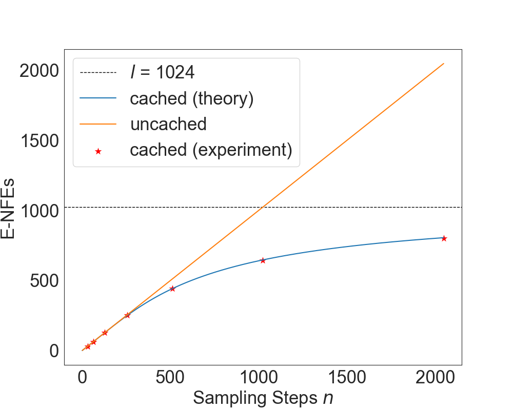
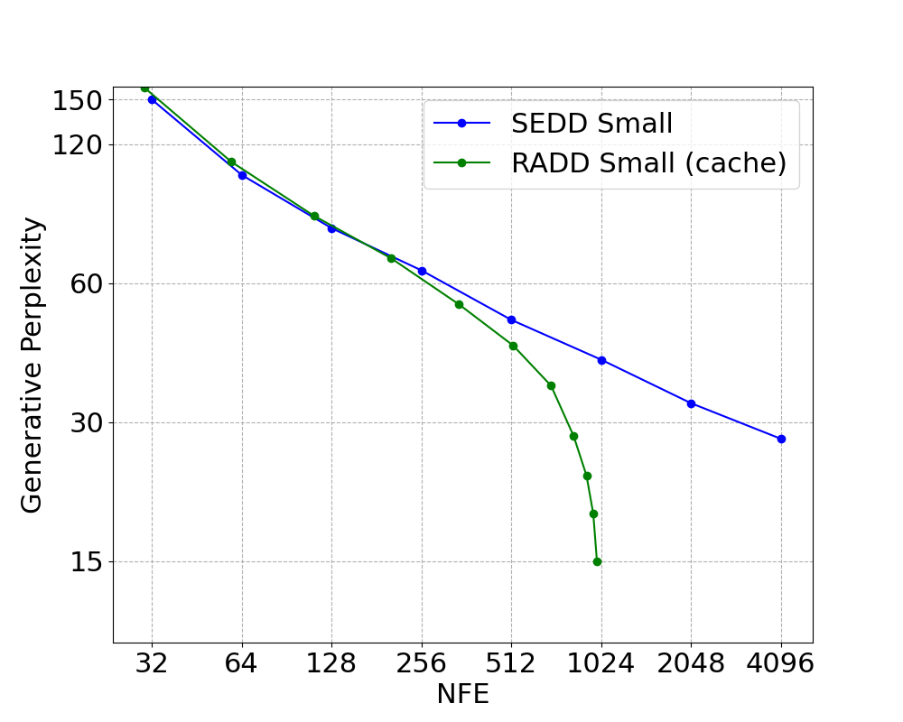

# Reparameterized Absorbing Discrete Diffusion

[](https://arxiv.org/abs/2406.03736)
[](https://huggingface.co/JingyangOu/radd-lambda-dce)

This repo contains an official PyTorch implementation for the paper [Your Absorbing Discrete Diffusion Secretly Models the Conditional Distributions of Clean Data](https://arxiv.org/abs/2406.03736) by Jingyang Ou, Shen Nie, Kaiwen Xue, Fengqi Zhu, Jiacheng Sun, Zhenguo Li and Chongxuan Li. 

We propose reparameterized absorbing discrete diffusion (RADD), a dedicated diffusion model without time condition that characterizes the time-independent conditional probabilities.
From this perspective, 
we demonstrated the unification of training objectives for absorbing discrete diffusion and any-order autoregressive models. Further, the removal of time condition allows for caching strategies to reduce the number of function evaluations.

This codebase contains:

- Implementation of the time-independent RADD architecture
- Sampling code for both diffusion-based  and any-order auto-regressive methods
- Training code with four different loss functions
- Evaluation code for zero-shot performance

## Code Organization
1. `run_train_ddp.py`: Codes for training
2. `sampling.py`: Codes for sampling
3. `noise_lib.py`: The noise schedule and forward diffusion
4. `model/`: The model architecture
5. `noise_lib.py`:  The noise schedule and  the forward process
6. `losses.py`: Loss functions

## Dependency
Create a conda environment containing the required dependencies:
```
conda env create -f environment.yml
conda activate radd
```
## Pretrained Models
Our RADD models, trained for 400k steps with different loss functions, are available on Hugging Face:
|Model|Loss function|
|:---:|:---:|
|[radd-lambda-dce](https://huggingface.co/JingyangOu/radd-lambda-dce)|$\lambda$-DCE|
|[radd-t-dce](https://huggingface.co/JingyangOu/radd-t-dce)|$t$-DCE|

For example, to load the `radd-t-dce` model and noise schedule, use the following code:
```python
from load_model import load_model
model, noise = load_model('JingyangOu/radd-t-dce', device='cuda') 
```

## Sampling

In `sampling.py`, we provide two samplers: `DiffusionSampler` for diffusion-based sampling and `OrderedSampler` for any-order auto-regressive sampling.

### Sampling with `OrderedSampler`

To perform any-order auto-regressive sampling, we need to define the generation order first. For example, we can use the following code to generate text in a forward order (0, 1, ..., args.length - 1):

```python
forward_order = torch.arange(0, args.length)
sampler = OrderedSampler(model, (args.batch_size, args.length), token_dim, args.strategy, args.strategy_para, forward_order, device=device)
samples = sampler.sample(args.steps)
```

Additionally, `OrderedSampler` supports `top_p` and `top_k` sampling strategies, in addition to the `direct` sampling strategy. Below is an script of using the `top_p` strategy:

```bash
python run_sample.py \
--model_path JingyangOu/radd-t-dce \
--batch_size 1 \
--length 1024 \
--steps 1024 \
--method ordered \
--strategy top_p \
--strategy_para 0.8
```

### Sampling with `DiffusionSampler`
The `DiffusionSampler` can be used with either the Tweedie $\tau$-leaping or Euler method, both of which support ***efficient batching sampling with a cache strategy*** that improves sampling speed by up to 3.5 times compared to samplers proposed in D3PM and SEDD. Here's an example of employing the Tweedie $\tau$-leaping method:

```bash
python run_sample.py \
--model_path JingyangOu/radd-t-dce \
--batch_size 2 \
--length 1024 \
--steps 1024 \
--method tweedie \
--strategy direct 
```

### Conditional Sampling
To perform conditional sampling, we can use the `DiffusionSampler` with the `prefix` and `suffix` argument. 
```bash
python run_sample_cond.py \
--model_path JingyangOu/radd-lambda-dce \
--batch_size 1 \
--length 1024 \
--steps 1024 \
--method tweedie \
--strategy direct \
--prefix "THIS IS PREFIX"  \
--suffix "THIS IS SUFFIX"
```

<details open>
<summary><font size="3">
Sampling evaluation results reported in the paper:
</font></summary>

<center>


</center>
</details>

## Training
We offer training code with Distributed Data Parallel (DDP) support for both single-machine multi-GPU setups and multi-machine multi-GPU configurations:
```bash
# single machine with multiple GPUs
torchrun --nnodes NNODES run_train_ddp.py

# multiple machines with multiple GPUs 
torchrun --nnodes NNODES --nproc_per_node NPROC_PER_NODE --master-addr MASTER_ADDR --node-rank NODE_RANK run_train_ddp.py 
```

A new directory `output/DATE/TIME` with the following structure will be created for each run:
```
├── output
│   ├── .hydra
│   │   ├── config.yaml
│   │   ├── ...
│   ├── checkpoints
│   │   ├── checkpoint_*.pth
│   ├── checkpoints-meta
│   │   ├── checkpoint.pth
│   ├── samples
│   │   ├── iter_*
│   │   │   ├── sample_*.txt
│   ├── wandb
│   │   ├── ...
│   ├── logs
```

Here, `checkpoints-meta` is used for reloading the run following interruptions, `samples` contains generated images as the run progresses, and `logs` contains the run output. Arguments can be added with `ARG_NAME=ARG_VALUE`, with important ones being:
```
ngpus                     the number of GPUs allocated for training (utilizing PyTorch DDP)
model                     options include small_radd, medium_radd
noise.type                options include geometric, loglinear 
training.accum            the number of gradient accumulation steps
training.loss_type        options include t_DSE, t_DCE, lambda_DCE, k_DCE
```
We have developed four distinct loss functions for RADD, detailed in `losses.py`. The desired loss function can be specified using the `training.loss_type` argument:

|Argument|Loss function|
|:---:|:---:|
|`t_DSE`|DSE loss|
|`t_DCE`|$t$-DCE loss|
|`lambda_DCE`|$\lambda$-DCE loss|
|`k_DCE`|any-order loss|

For example, to train a model using the $t$-DCE loss on a single machine equipped with 8 A100 80G GPUs:
```bash
# Train a model with t-DCE loss with 8 * A100 80G GPUs in a single machine
torchrun --nproc-per-node=8 train_ddp.py noise.type=loglinear model=small_radd ngpus=8 training.accum=1 training.loss_type=t_DCE
```

## Evaluation
To evaluate the zero-shot performance of the trained model, 
we provide an evaluation script to calculate the model's perplexity (PPL) on a specified test dataset. Below is the example usage of the evaluation script:

```bash
python evaluation_modeling.py \
--batch_size 16 \
--model_path JingyangOu/radd-lambda-dce \
--length 1024 \
--valid_dataset ptb \
--monte_carlo_timesteps 1024 \
--ngpus 4 \
--loss_type lambda_DCE \
--work_dir ./logs/radd-lambda-dce
```

This will output the evaluation perplexity (PPL) in the specified `work_dir`. Make sure to adjust the arguments according to your setup and dataset.

## Acknowledgements

This repository was built off [SEDD](https://github.com/louaaron/Score-Entropy-Discrete-Diffusion).
## Citation
```
@misc{ou2024absorbingdiscretediffusionsecretly,
      title={Your Absorbing Discrete Diffusion Secretly Models the Conditional Distributions of Clean Data}, 
      author={Jingyang Ou and Shen Nie and Kaiwen Xue and Fengqi Zhu and Jiacheng Sun and Zhenguo Li and Chongxuan Li},
      year={2024},
      eprint={2406.03736},
      archivePrefix={arXiv},
      primaryClass={cs.LG},
}
```
